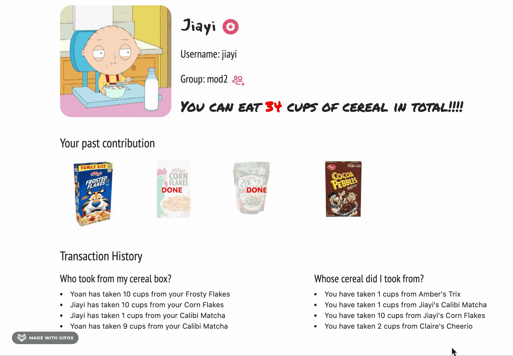

<h1 align="middle"> Cereal Trader :bowl_with_spoon:</h1>

## Problem 
This is another Ordinary day at the Flatiron School. You arrive at your floor at 8:59 in the morning and are ready to have a cup of your favorite cereal. You love this brand so much that you took a box to the office from home. When you open the box, guess what happened? It is EMPTY!!!! 

  

It looks like there has been the "cereal-sharing" thing going on at this floor, and others must have taken from your box by mistake. Should you revenge and took from their boxes? But you are worried it would ruin another poor person's morning as well. 

## Description
The ultimate solution to this problem is -- Cereal Trader,  a Ruby app that allows people to "trade" their cereals.

  

One could use the app to keep track of who took from your box with Cereal Trader, or whose cereal did you took from. 

## Technology
* Scraped cereal box pictures from Google Image using Nokogiri
* Developed the app with Ruby, HTML, CSS and RESTful API
